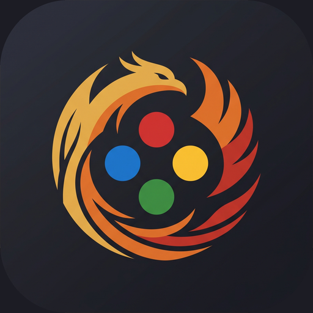
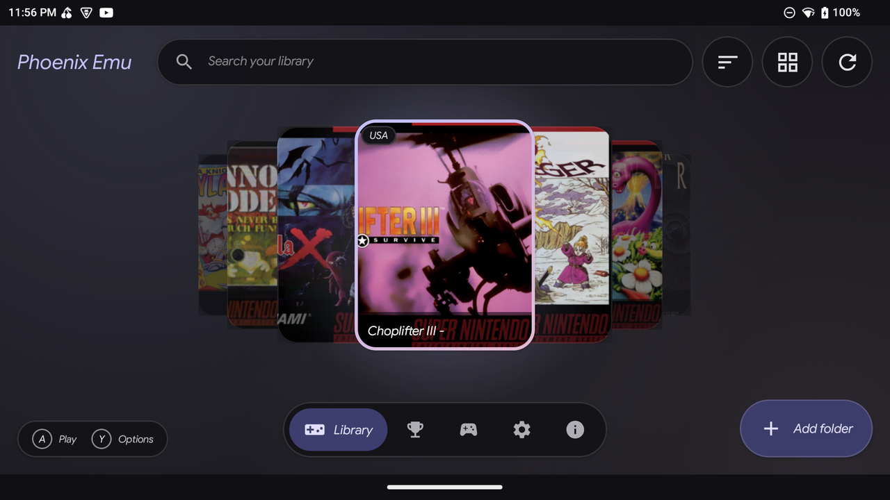
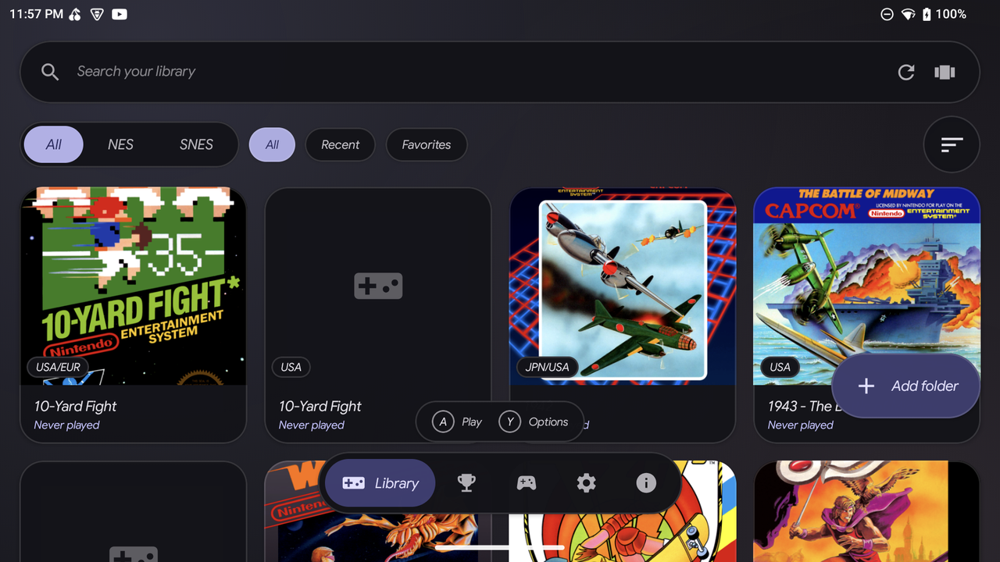
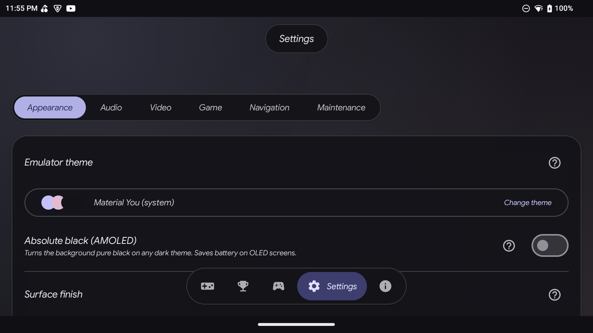
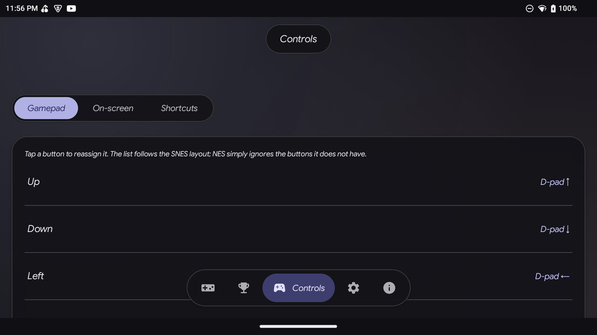

<p align="center">
  
</p>

<h1 align="center">Phoenix Emu</h1>

<p align="center">
  <b>A free NES &amp; SNES emulator for Android, built for handhelds and gamepads.</b><br>
  Console-style library, themeable glass UI, save states, rewind, shortcuts and more.
</p>

<p align="center">
  English · <a href="README.pt-BR.md">Português (Brasil)</a>
</p>

> **Status: pre-release, private development.** Phoenix Emu is being built and tested mainly on the **AYN Odin 3** (landscape, gamepad). Portrait mode has not been tested yet. The repository will be opened when the emulator is ready for a first public release.

---

## Screenshots

<table>
  <tr>
    <td><br><sub>Library, cover-flow (XMB) mode</sub></td>
    <td><br><sub>Library, grid mode</sub></td>
  </tr>
  <tr>
    <td><br><sub>Settings, organised in tabs with help hints</sub></td>
    <td><br><sub>Controls: gamepad mapping, on-screen, shortcuts</sub></td>
  </tr>
</table>

---

## Features

### Emulation
- **NES** and **SNES** through [libretro](https://www.libretro.com/) cores (Mesen for NES, Snes9x for SNES), running in a dedicated process so the UI never competes with the emulation loop.
- Low-latency audio through [Oboe](https://github.com/google/oboe); the emulation loop is driven by the audio clock.
- **Save states** with 4 slots per game and a thumbnail for each slot.
- **Auto-save on exit / auto-load on start** (each one can be switched off).
- **Fast-forward** and **rewind** (a ring buffer of recent states), mapped by default to R2 and L2.
- **Shortcut engine**: every extra function (save/load state, previous/next slot, fast-forward, rewind, menu, reset) can be bound to any button, with an optional "hotkey" button for RetroArch-style combos (hold the hotkey + press a button).
- Aspect-ratio and video-filter options.

### Library
- Scans the folders you choose and builds the library automatically.
- Two views: a **cover-flow carousel** (console-menu style, big covers, fixed top bar, floating navigation) and a classic **grid**. You choose which one you want.
- Search, system filter (NES / SNES), recents, favorites and sorting.
- Cover art and metadata fetched online, region badges (USA / EUR / JPN) and ROM identification by CRC32.
- Fully navigable with a gamepad: D-pad / stick to move, **A** to play, **Y** for options, **L1 / R1** to switch sections.

### Interface
- **Glass UI** with live blur (Android 12+) and a lighter fallback for older or weaker devices; or a **solid** finish if you prefer.
- Themes: Material You (follows your system), **NES (US)**, **Famicom (JP)**, **SNES (US)**, **Super Famicom (JP)**, plus an absolute-black **AMOLED** option.
- Custom wallpaper with adjustable blur and opacity, "reduce effects" mode for weaker devices.
- Portuguese and English, with a **"?" help balloon on every setting**.
- Settings organised in tabs (Appearance, Audio, Video, Game, Navigation, Maintenance).
- *Everything is an option, nothing is a rule*: each new behaviour has its own on/off switch.

### Controls
- Physical gamepad remapping.
- On-screen controller with an editor: drag every button, adjust opacity and size.
- Shortcuts tab with a configurable hotkey.
- **Controller skins**: three built-in styles plus community skins. Import a `.zip`, or browse and install them from the in-app **Download skins** library, which reads the [phoenix-emu-skins](https://github.com/dfdx047/phoenix-emu-skins) catalog (anyone can contribute with a Pull Request). Choose up to 3 skins to keep in the in-game quick menu.
- Auto-hide the on-screen controls when a gamepad is used; touch the screen and they come back.

### RetroAchievements
- Sign in with your RetroAchievements account; the app identifies your games by ROM hash.
- **Live unlocks while you play**, through the official `rcheevos` library (NES and SNES), with a pop-up and sound at the moment of the unlock.
- Pop-up options: on/off, sound, vibration, volume, duration and six screen positions, following the app's glass or solid look.
- A dedicated screen with your last played game, recents and the full list with progress.

---

## Roadmap

Planned work, roughly in order:

| Area | What is coming |
|---|---|
| **Game menu** | A themed side menu inside the game (swipe or Back): save-state manager, settings, filters, control remapping, game info. |
| **Fast-forward / rewind** | Configurable speeds (2x up to 16x), hold or toggle modes, on-screen indicator with remaining rewind time, optional FPS and frame-time counter. |
| **Core options** | All options exposed by each core, shown automatically, with layers: core default, global and per-game. Controller types per port, 2 players, multitap, mouse, Super Scope, Zapper, cheats, overscan, volume, turbo. |
| **OpenGL ES video** | GLES renderer with integer scaling, aspect ratios, overscan crop, plus GLSL filters (sharp-bilinear, scanlines, CRT, LCD grid, xBR/HQ2x-like, NTSC) with adjustable parameters, global and per game. Run-ahead for near-zero latency. |
| **On-screen controls & skins** | Pixel-faithful NES/SNES layouts, community skins (`.zip`, imported through the system file picker), a full editor with new buttons: combo, turbo, save/load state, fast-forward, rewind, pause, menu, reset. Haptics, auto-hide when a gamepad is connected. |
| **RetroAchievements** | Hardcore mode, a game-start notice ("0/27 achievements"), and the achievement list inside the in-game pause menu. |
| **Quality & release** | Emulator-thread affinity fix, power target of about 2 W on a Snapdragon 8 Elite, GPL licences screen with source offer for the cores, save backup/export, adaptive icon, privacy policy, Play Store. Evaluation of Mesen2 as an alternative NES core. |

---

## Building from source

Requirements: Android Studio (current stable), the Android SDK and NDK, and a device or emulator.

```bash
git clone <this repository>
cd PhoenixEmu
./gradlew installDebug
```

Optional, for cover art: create a free [RAWG](https://rawg.io/apidocs) API key and put it in `~/.gradle/gradle.properties` (never in the repository):

```properties
RAWG_API_KEY=your_key_here
```

The app does **not** ship any games. Add your own ROM folder from the library screen.

### Project layout

| Module | Role |
|---|---|
| `:app` | Compose UI, library, settings, themes, preferences. |
| `:emulator` | The engine: libretro host, JNI bridge, audio (Oboe), game activity. Runs in its own process (`:emu`). |

---

## Default gamepad shortcuts

| Button | Action |
|---|---|
| R2 | Fast-forward |
| L2 | Rewind |
| L1 / R1 | Previous / next section (library) |
| A / Y | Play / options (library) |

Every other shortcut starts unassigned and can be set in **Controls ▸ Shortcuts**.

---

## Legal

Phoenix Emu is an emulator. It does **not** include ROMs, BIOS files or any copyrighted game. Use only games you own and have dumped yourself. "Nintendo", "NES", "Famicom", "SNES" and "Super Famicom" are trademarks of their respective owners; this project is not affiliated with or endorsed by them.

## Support the project

Phoenix Emu is free. A Ko-fi donation link will be added here and in the app for the first public release.

## Credits

- [libretro](https://www.libretro.com/) API and community
- [Mesen](https://github.com/SourMesen/Mesen) (NES) and [Snes9x](https://github.com/snes9xgit/snes9x) (SNES) emulation cores
- [Oboe](https://github.com/google/oboe) low-latency audio
- [RAWG](https://rawg.io/) game metadata and cover art
- [RetroAchievements](https://retroachievements.org/) and [rcheevos](https://github.com/RetroAchievements/rcheevos) (MIT)

## License

Phoenix Emu is licensed under the **GNU General Public License v3.0**. See [LICENSE](LICENSE). The bundled Mesen core is GPL-licensed. The bundled Snes9x core is distributed under the [Snes9x license](https://github.com/snes9xgit/snes9x/blob/master/LICENSE), which allows free redistribution but **not commercial use**; for that reason Phoenix Emu is free and must stay non-commercial while it ships that core. `rcheevos` is MIT-licensed.
